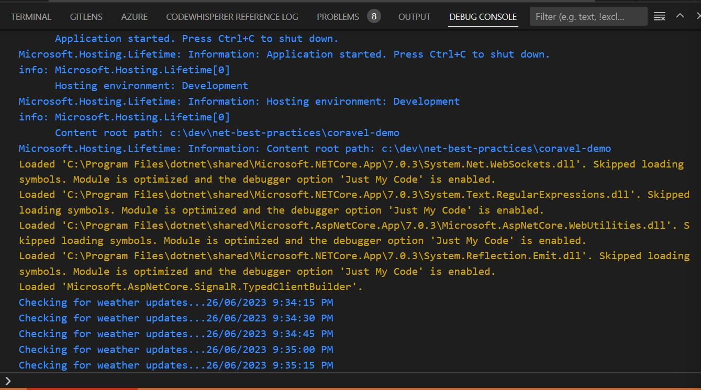
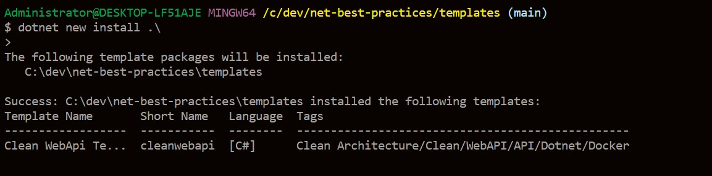
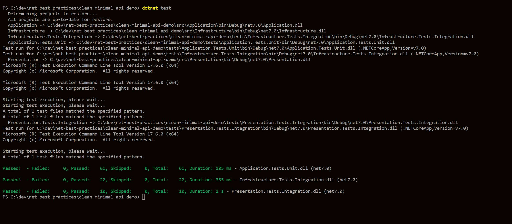

# .Net Best Practices

# Tech Stack

- [x] Json source generator
- [x] Minimal API
- [x] Coravel
- 
- [x] RestSharp
- [x] QUIC(HTTP3)
- [x] Design Pattern
- [x] .Net Template
- 
- [x] Clean Architecture Test
- [x] Clean Architecture Minimal Api Tempalte
- 

```c#
# json source generator
$ dotnet new sln
$ dotnet new web -o json-source-generator
$ dotnet sln add json-source-generator

$ dotnet add .\json-source-generator\ package Swashbuckle.AspNetCore

$ dotnet dev-certs https --trust

$ dotnet build

$ dotnet run --project .\json-source-generator\json-source-generator.csproj

# cravel
$ dotnet new webapi -o coravel-demo
$ dotnet add package coravel

# restsharp
$ dotnet new webapi -o restsharp-demo
$ dotnet sln add restsharp-demo
$ dotnet add .\restsharp-demo\ package RestSharp
$ dotnet add .\restsharp-demo\ package Newtonsoft.Json


# quic
$ dotnet new webapi -o quic-server
$ dotnet new console -o quic-client

$ dotnet sln add .\quic-demo\quic-server\
$ dotnet sln add .\quic-demo\quic-client\

$ dotnet run

# design pattern
$ dotnet new console -o strategy-demo

# clean-api-template
$ cd templates
# copy source to templates
# change template.json
# create template
$ dotnet new install .\
$ dotnet new list
# create project base on template
$ dotnet new cleanwebapi -o clean-web-api-demo
# clean architecture test
$ dotnet test

# Clean Architecture Minimal Api Tempalte
$ dotnet new install cleanwebapi -o clean-web-api-demo

# check installed template
$ dotnet new --list

$ dotnet new cleanminimalapi --name clean-minimal-api-demo
or
$ dotnet new cleanminimalapi -o clean-minimal-api-demo

```
