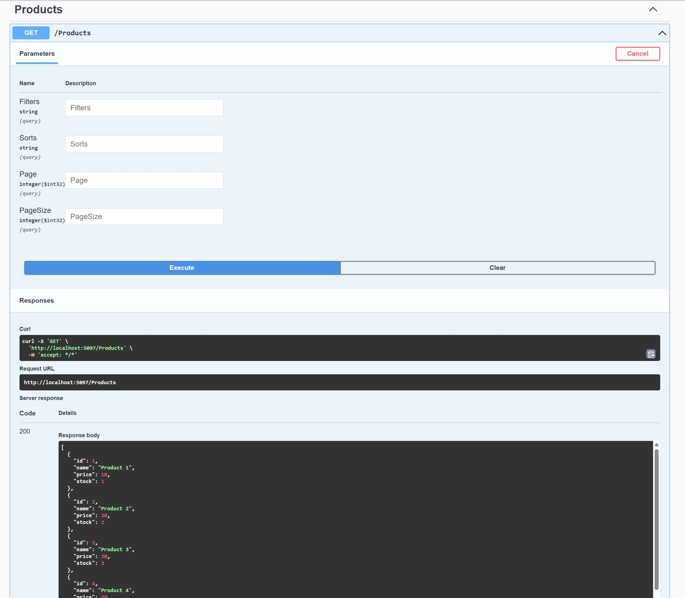

# .Net Best Practices

# Tech Stack

- [x] Json source generator
- [x] Minimal API
- [x] Coravel
- 
- [x] RestSharp
- [x] QUIC(HTTP3)
- [x] Design Pattern
- [x] .Net Template
- 
- [x] Clean Architecture Test
- [x] Clean Architecture Minimal Api Tempalte
- 
- [x] Sieve
- 
-

## json source generator

```c#
$ dotnet new sln
$ dotnet new web -o json-source-generator
$ dotnet sln add json-source-generator

$ dotnet add .\json-source-generator\ package Swashbuckle.AspNetCore

$ dotnet dev-certs https --trust

$ dotnet build

$ dotnet run --project .\json-source-generator\json-source-generator.csproj
```

## cravel

```c#
$ dotnet new webapi -o coravel-demo
$ dotnet add package coravel
```

# restsharp

```c#
$ dotnet new webapi -o restsharp-demo
$ dotnet sln add restsharp-demo
$ dotnet add .\restsharp-demo\ package RestSharp
$ dotnet add .\restsharp-demo\ package Newtonsoft.Json
```

# quic

```c#
$ dotnet new webapi -o quic-server
$ dotnet new console -o quic-client

$ dotnet sln add .\quic-demo\quic-server\
$ dotnet sln add .\quic-demo\quic-client\

$ dotnet run
```

# design pattern

```c#
$ dotnet new console -o strategy-demo
```

# clean-api-template

```c#
$ cd templates
# copy source to templates
# change template.json
# create template
$ dotnet new install .\
$ dotnet new list
# create project base on template
$ dotnet new cleanwebapi -o clean-web-api-demo
# clean architecture test
$ dotnet test
```

# Clean Architecture Minimal Api Tempalte

```c#
$ dotnet new install cleanwebapi -o clean-web-api-demo

# check installed template
$ dotnet new --list

$ dotnet new cleanminimalapi --name clean-minimal-api-demo
or
$ dotnet new cleanminimalapi -o clean-minimal-api-demo
```

## Sieve

```javascript
$ dotnet new webapi -o sieve-demo
$ dotnet sln add sieve-demo
$ dotnet add .\sieve-demo\ package Sieve
$ dotnet build
$ dotnet run --project .\sieve-demo\sieve-demo.csproj
```

## Minimal Webhook

```c#
$ dotnet new cleanminimalapi -o minimal-webhook-demo
# cd minimal-webhook-demo
$ dotnet run --project ./src/Presentation
```

## Caching

### Tech Stack

- [x] Caching
- [x] GenFu
- [x] Yarp
- [x] NBomber
- 
- 

```c#

# [TODO]
$ dotnet new cleanminimalapi -o minimal-caching-demo
# cd minimal-caching-demo
$ dotnet run --project ./src/Presentation
$ dotnet add ./src/Infrastructure package GenFu
# cd src
$ dotnet new webapi -o YarpApi
$ dotnet sln add YarpApi
$ dotnet add ./src/YarpApi package Yarp.ReverseProxy

# basic
$ dotnet new sln -o caching
# cd caching
$ dotnet new webapi -o WebApi
$ dotnet add .\WebApi package GenFu
$ dotnet run --project .\WebApi\

# YARP
$ dotnet new webapi -o YarpApi
$ dotnet add ./YarpApi package Yarp.ReverseProxy

# load test
$ dotnet new console -n NBomberTest
$ dotnet add .\NBomberTest package NBomber
$ dotnet add .\NBomberTest\ package NBomber.http
$ dotnet add .\NBomberTest package GenFu
$ dotnet add .\NBomberTest\ reference .\YarpApi\

$ dotnet sln add (ls -r **//*.csproj)
$ dotnet build

# docker
$ docker build . -t api -f .\WebApi\Dockerfile
$ docker build . -t yarp -f .\YarpApi\Dockerfile.YARP
$ docker image list
$ docker rmi Image api

# docker compose
$ docker-compose up
$ docker-compose down

# execute NBomberTest

# Add cache to webapi
$ dotnet add .\WebApi package NRedisStack
$ dotnet add .\WebApi package Microsoft.Extensions.Caching.Memory
$ dotnet add .\WebApi package Scrutor

# add redis conf
$ docker build . -t myredis -f .\Dockerfile.redis
$ docker start myredis
$ docker stop myredis

# restart docker
$ docker compose down
$ docker build . -t api -f .\WebApi\Dockerfile
$ docker compose up
```
