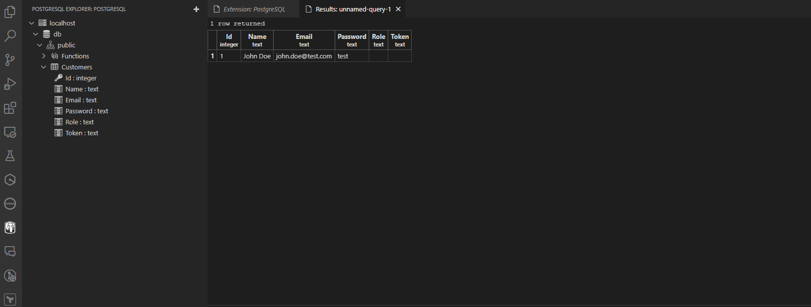
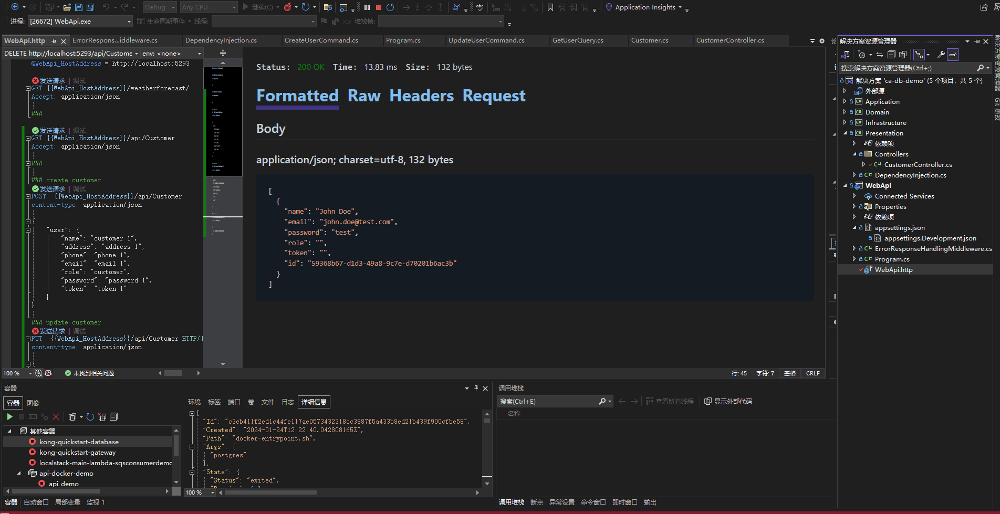

CA DB Demo

## Tech Stack

- [x] Postgres SQL

- [x] CA
- [x] EF Core/Npgsql
- [x] MediatR
- [x] Result Pattern - FluentResult
- [x] REST Client extension

- [x] Contract Test - PactNET

````dotnetcli

# run db in docker
$ docker-compose up -d
$ docker ps
# stop db
$ docker-compose down

# create sln
$ dotnet new sln -o ca-db-demo

$ dotnet new webapi -o WebApi
$ dotnet new classlib -o Presentation
$ dotnet new classlib -o Infrastructure
$ dotnet new classlib -o Application
$ dotnet new classlib -o Domain

# powershell, add to sln
$ dotnet sln add (ls -r **/*.csproj)

$ dotnet add .\Domain\ package Newtonsoft.Json   

$ dotnet build

$ dotnet add .\Application\ package MediatR
$ dotnet add .\Application\ package MediatR.Extensions.Microsoft.DependencyInjection
$ dotnet add .\Application\ package FluentValidation.DependencyInjectionExtensions

$ dotnet add .\Application\ package Microsoft.Extensions.DependencyInjection
$ dotnet add .\Infrastructure\ package Microsoft.Extensions.DependencyInjection
$ dotnet add .\Presentation\ package Microsoft.Extensions.DependencyInjection
$ dotnet add .\Domain\ package Microsoft.Extensions.DependencyInjection
$ dotnet add .\WebApi\ package Swashbuckle.AspNetCore
$ dotnet add .\Presentation\ package Swashbuckle.AspNetCore

$ dotnet add .\Application\ reference .\Domain\
$ dotnet add .\Infrastructure\ reference .\Application\
$ dotnet add .\Presentation\ reference .\Application\

$ dotnet add .\Infrastructure\ package Npgsql.EntityFrameworkCore.PostgreSQL
$ dotnet add .\Infrastructure\ package Microsoft.EntityFrameworkCore.Tools
$ dotnet add .\Infrastructure\ package Microsoft.EntityFrameworkCore
$ dotnet add .\Infrastructure\ package Microsoft.EntityFrameworkCore.Design

$ dotnet sdk check

$ dotnet tool install --global dotnet-ef

# fluent result
$ dotnet add .\WebApi\ package FluentResults

# unit test
$ dotnet new xunit -o UnitTests
$ dotnet sln add .\UnitTests\UnitTests.csproj

# contract test
$ dotnet add .\UnitTests package PactNet
```