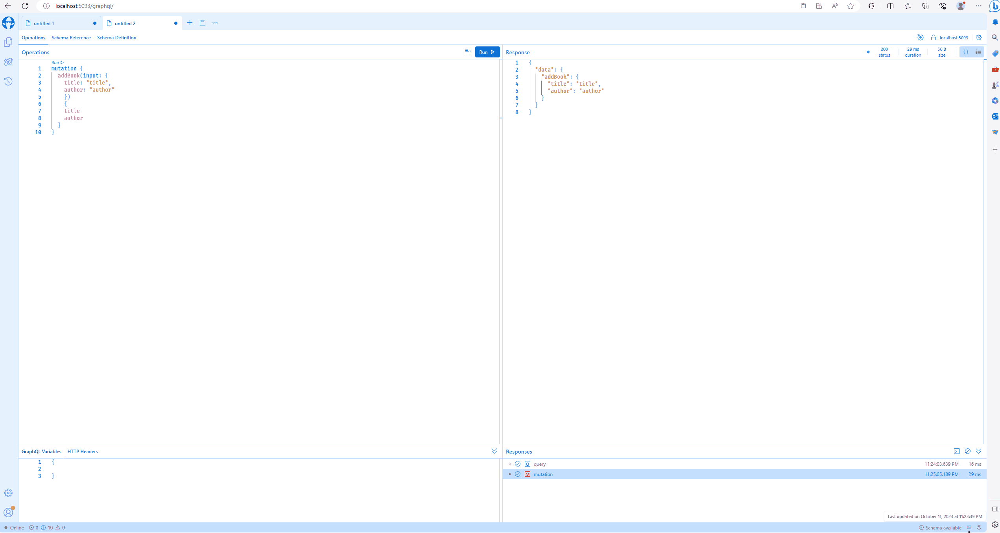

# .Net Core GraphQL Demo

## Tech Stack

- [x] GraphQL
- [x] Hot Chocolate
- [x] Banana Cake Pop
- 

```dotnetcli
$ dotnet new sln -o graphql
# cd graphql
$ dotnet new webapi -n WebApi

$ dotnet sln add (ls -r **//*.csproj)

# cd WebApi
$ dotnet add package HotChocolate.AspNetCore
$ dotnet add package HotChocolate.AspNetCore.Playground

$ dotnet build

$ dotnet run --project .\WebApi\

# http://localhost:5093/graphql/

```
